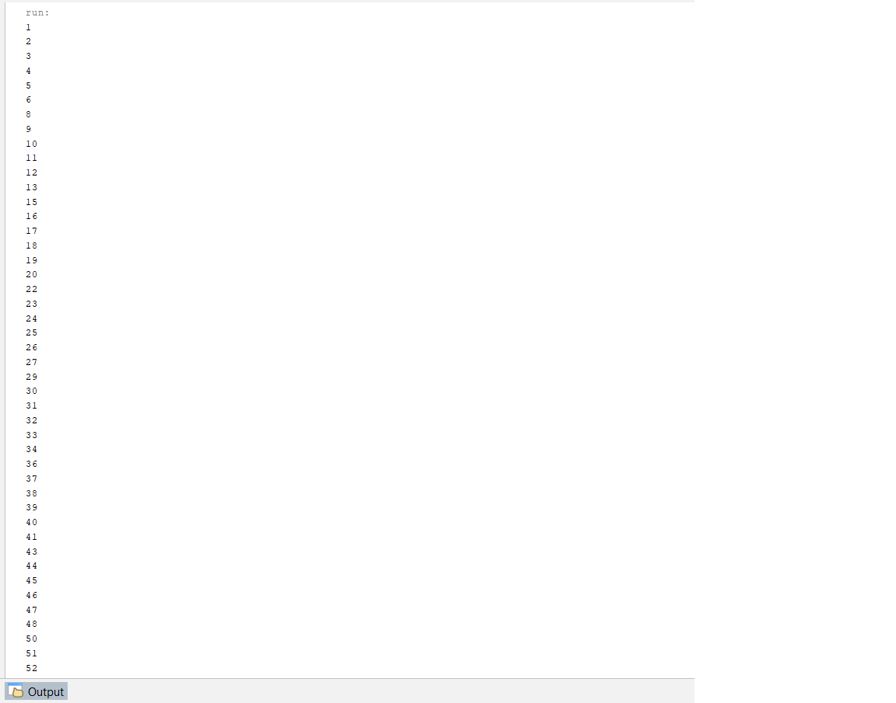
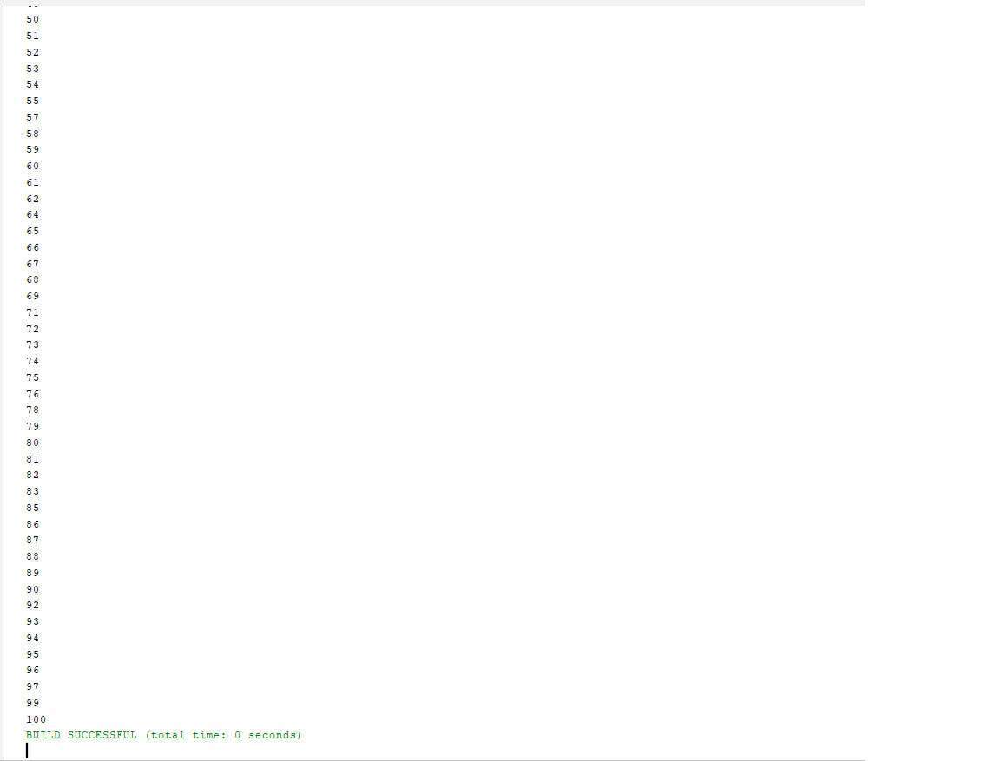
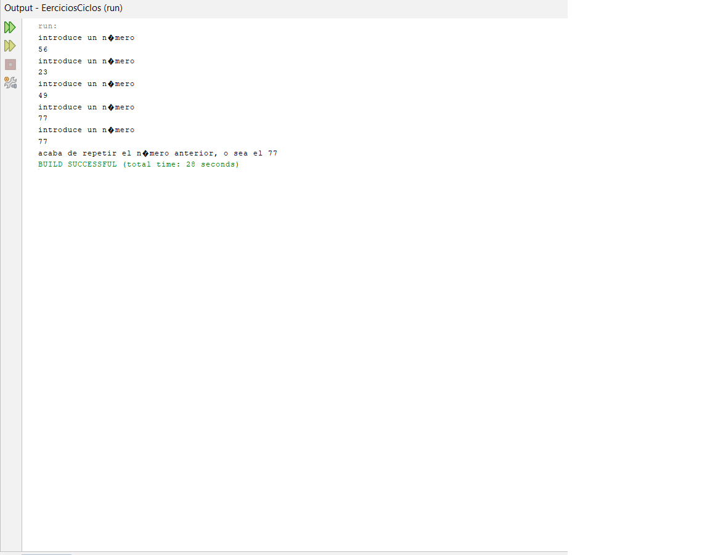
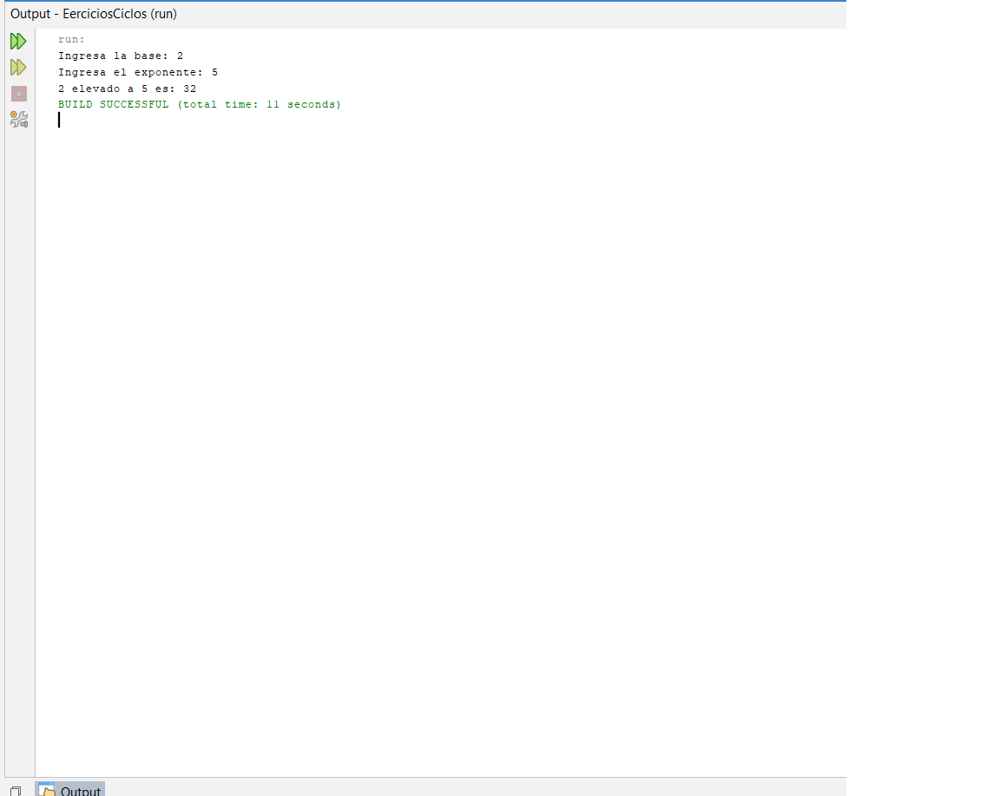
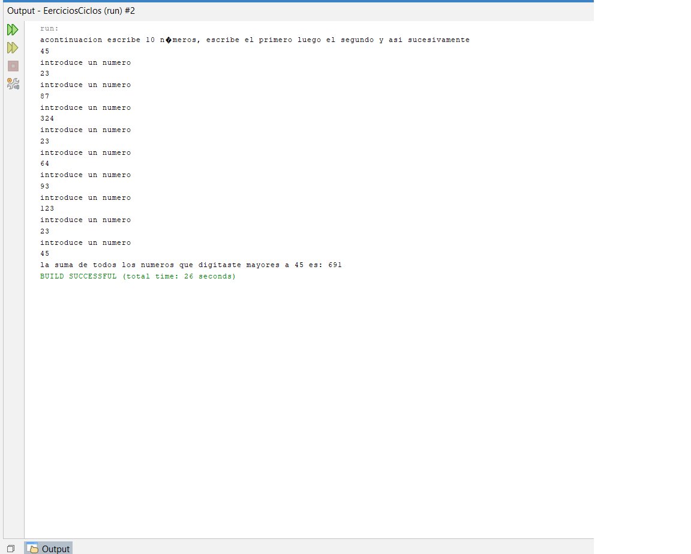
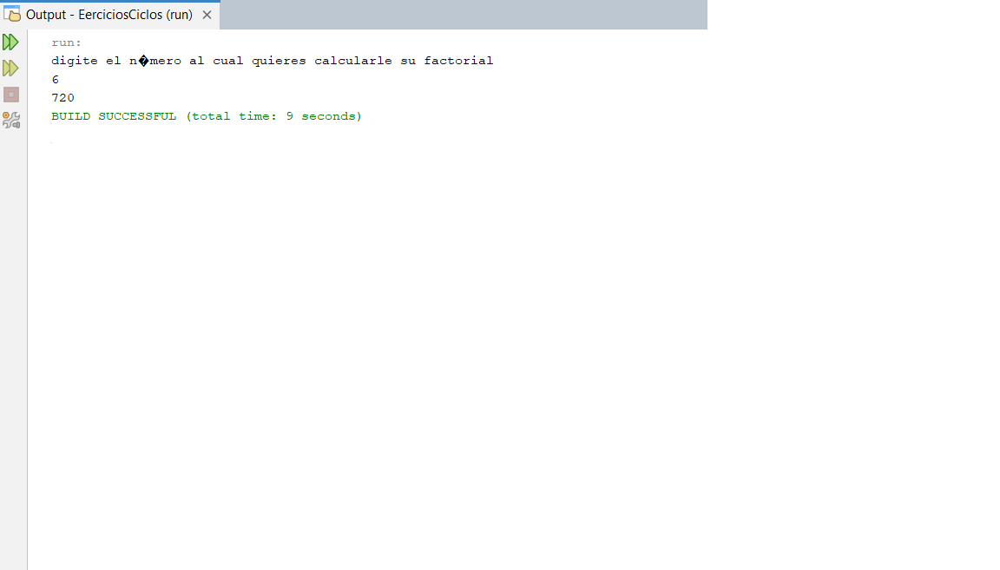
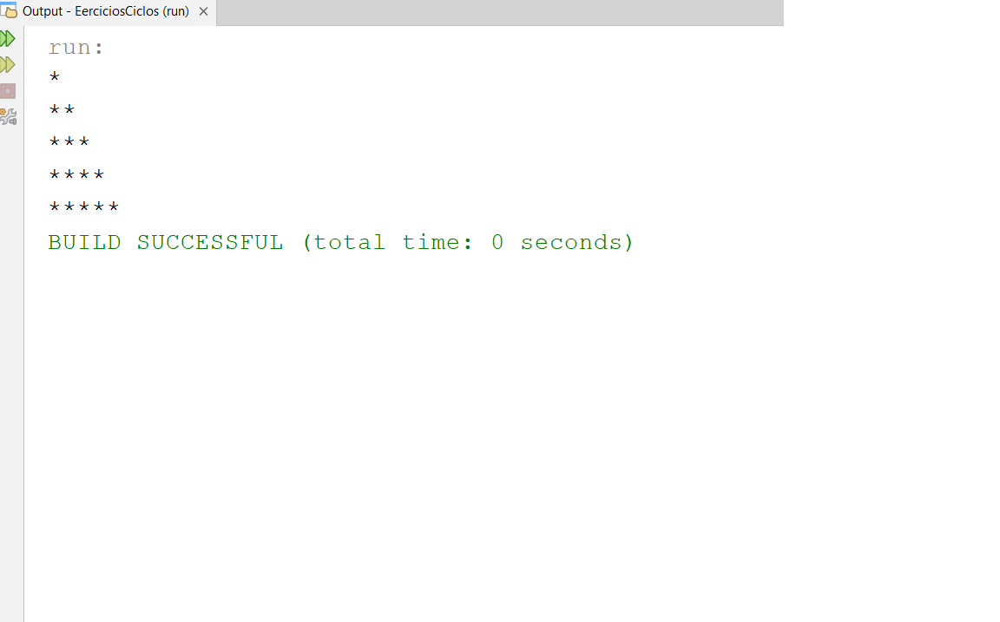

## 1.
# Proyectos ejercicios ciclos

---

## 2. INFORMACION DEL ESTUDIANTE
**Nombre Completo:** Jesús David Tovar Rojas
**Programa Academico:** Tecnologia en desarrollo de software
**Fecha de Entrega:** 04/09/2026

---

## 3. EVIDENCIAS
 - captura de pantalla de los ejercicios:
### Ejercicio 1
>3.a.2. Programa que muestre los números del 1 al 100, pero sin mostrar los múltiplos de 7.

### Ejercicio 2
>3.a.16.Programa que pide por teclado números, de manera continua, hasta que se introducen dos números iguales

### Ejercicio 3
>3.b.3. Escribir un programa que pida una base y un exponente (ambos números son enteros positivos) y que calcule la potencia. Ejemplo, si se indica 3 y 4, nos da 81 de solución (3 elevado a 4, es 3*3*3*3).

### Ejercicio 4
>3.b.5. Realizar un programa que pida al usuario 10 números. Debe calcular el resultado de sumar los números introducidos que sean mayores que el primer numero introducido .

### Ejercicio 5
>Mostrar por pantalla todos los números primos que hay entre 1 y 200

### Ejercicio 6
>3.c.1. Pedir por teclado un número y calcular su factorial. Si el número introducido es negativo se seguirá 
 pidiendo hasta que sea positivo.

### Ejercicio 7
>Escribir un programa que muestre esto por pantalla:
            *
            **
            ***
            ****
            *****

## Conclusiones
Estuvo complicado, me tuve que ayudar con la inteligencia artificial, al final pude hacer ejercicios pero se me complico mucho.

}
